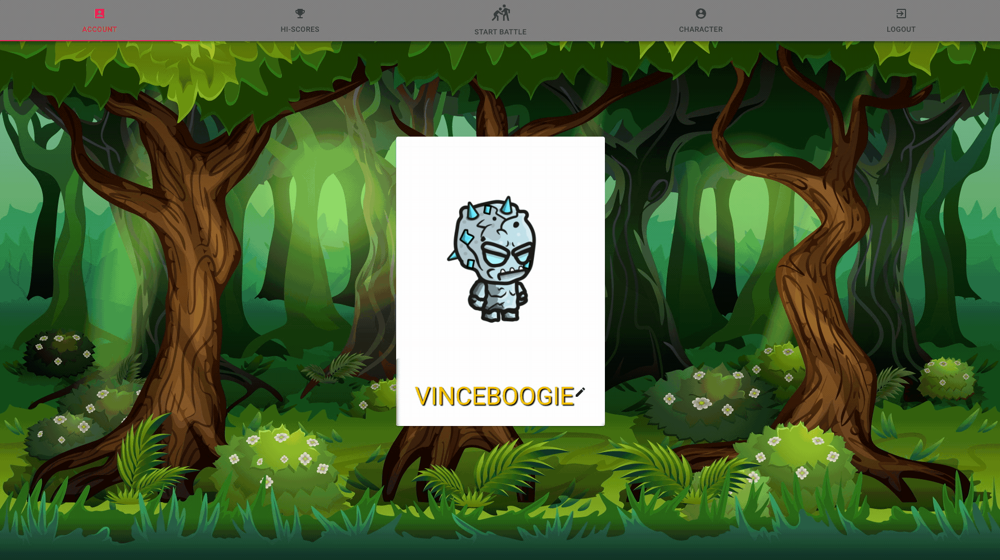
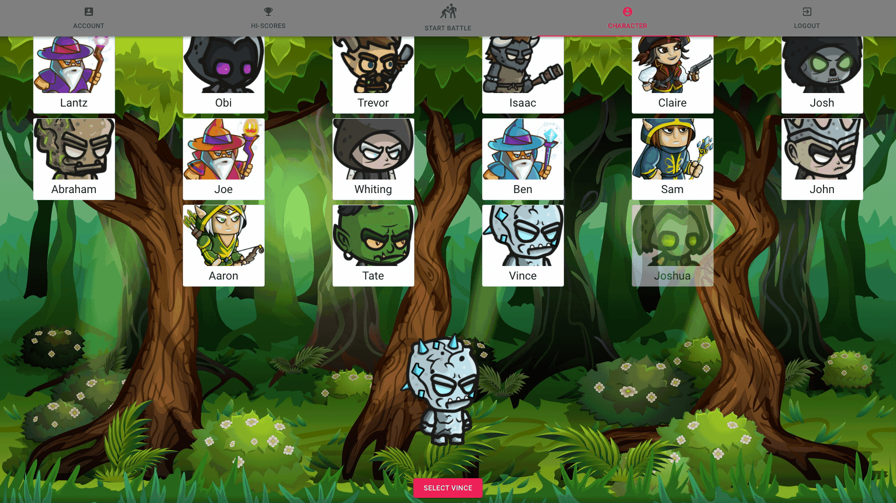
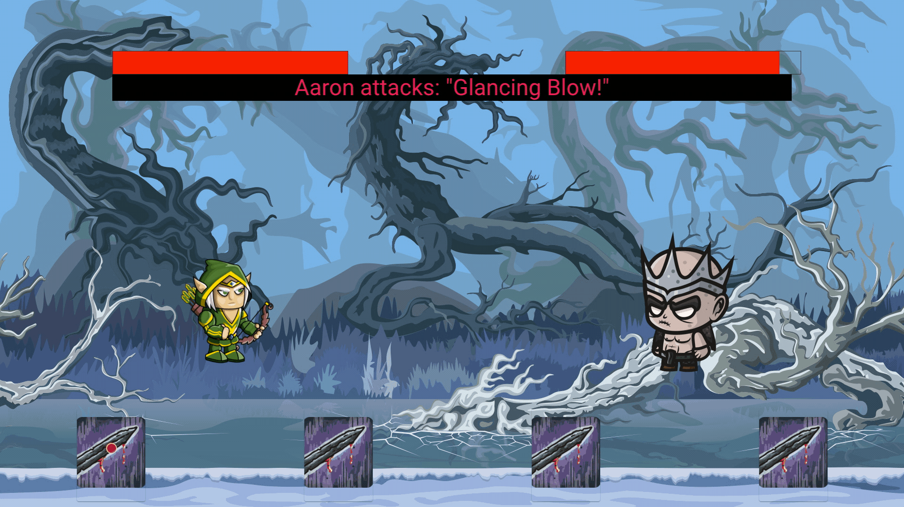
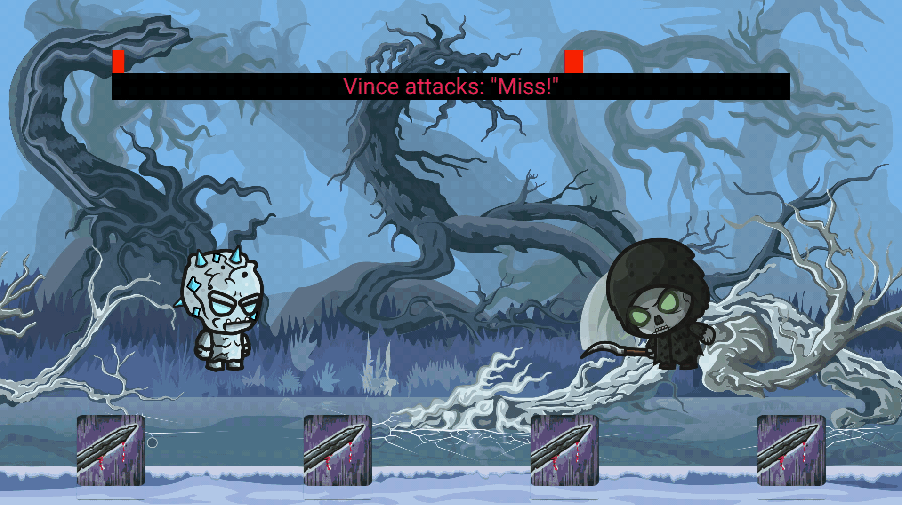

 

# Guardians of the Banana

> Guardians of the Banana is a turn-based 1v1 fighting game.

## Table of Contents

- [General Info](#general-information)
- [Technologies Used](#technologies-used)
- [Features](#features)
- [Screenshots](#screenshots)
- [Setup](#setup)
- [Usage](#usage)
- [Project Status](#project-status)
- [Room for Improvement](#room-for-improvement)
- [Acknowledgements](#acknowledgements)
- [Contact](#contact)
<!-- * [License](#license) -->

## General Information

- We created Guardians of the Banana as a fun project to create a fighting game with custom battle logic.
<!-- You don't have to answer all the questions - just the ones relevant to your project. -->

## Technologies Used

- React
- Ruby on Rails
- Postgres
- Active Record
- Material-UI

## Features

- Character selection
- 1v1 battle vs CPU

## Demo

<!-- If you have screenshots you'd like to share, include them here. -->

## Setup

- Clone the repository to your local machine
- Open project in your editor
- Open terminal from editor or 'cd' to project directory and run:
  - bundle install
  - rails s
- Open another terminal and run:
  - npm install --prefix client
  - npm start --prefix client

## Project Status

Project is: _complete_

## Contributors

Tate | [Github](https://github.com/tjray-dev)

Aaron | [Github](https://github.com/AaronDski)

Vincent | [Github](https://github.com/vincentbaylon)

<!-- Optional -->
<!-- ## License -->
<!-- This project is open source and available under the [... License](). -->

<!-- You don't have to include all sections - just the one's relevant to your project -->
